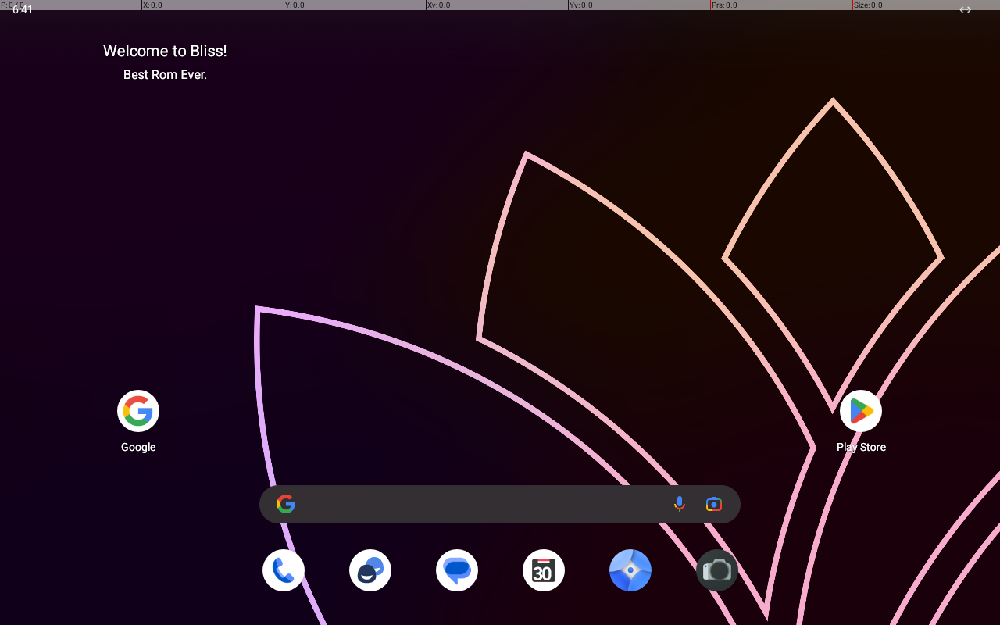
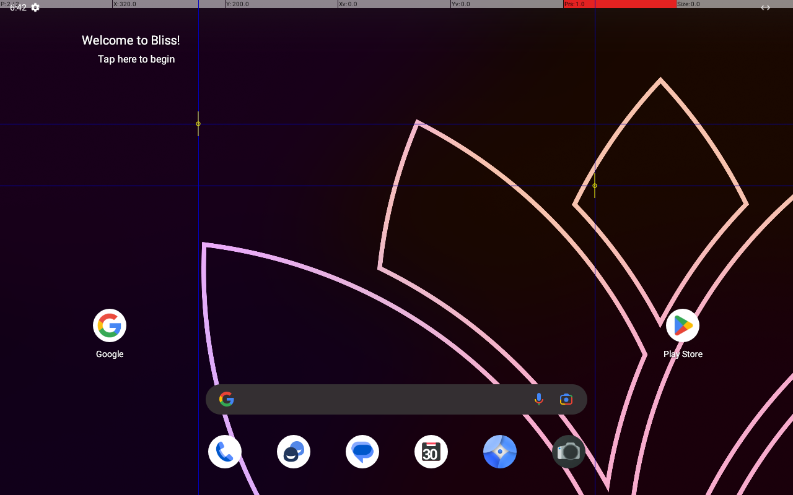

# QMP multitouch measurement

Date: 2026-09-27. Scope: the three questions in `docs/ARCHITECTURE.md` section 6.
This is a measurement on the existing developer guest, not an input-routing fix.
No game was opened and no application was installed or removed.

## Environment and reproduction

- Host: Windows 11 Education 22621, i5-12600KF, RTX 2080 SUPER (the M1 host).
- QEMU: custom build discovered by `Find-OmeQemu`; its `Version` comes from the
  module-private `Get-OmeQemuVersion`. The binary reports **11.1.1
  (v11.1.1-dirty)**, not the 11.1.0 assumed in the brief. Both tags' QAPI were fetched.
- Existing disk: `%LOCALAPPDATA%/OpenMobileEmulator/vm/default/disk.qcow2`;
  Bliss 16.9.7, Android 13, build `TQ3A.230901.001.C1`, screen 1280 x 800.
- WHPX, Skylake-Client-v4, 8192 MiB, 4 vCPU, virgl, SDL, `usb-tablet` and extra
  **`-device virtio-multitouch-pci`**. No input routing properties.
- QMP: loopback port 4444. adb: `127.0.0.1:5555`.
- No QEMU process existed before each start. Only this task's guest was stopped.
- `Start-Guest -Wait` waits for process exit, not QMP readiness, so it was omitted.
  The launcher already waits for QMP. `Wait-OmeAdbBoot` then waits for
  `sys.boot_completed=1`.

Final capture run started at **18:41:23.7639764 +09:00**, boot completed at
**18:41:56.4836204 +09:00**, elapsed **32.719644 seconds**, including launcher
startup. Earlier starts took 32.9494282 and 32.3655493 seconds.
[Boot/version output](multitouch/boot.txt), [final launcher output](multitouch/start-final.txt).

Reproduce from PowerShell 7. Pass the extra argument array inside PowerShell,
not as a comma-containing scalar to `pwsh -File`.

```powershell
cmd /c 'tasklist | findstr /i qemu'
# Stop here if any QEMU process is listed.
Import-Module 'C:/Open Mobile Emulator/launcher/OME.Common.psm1' -Force
& 'C:/Open Mobile Emulator/launcher/Start-Guest.ps1' -Gpu virgl -ExtraArgs @('-device', 'virtio-multitouch-pci')
Wait-OmeAdbBoot -Serial 127.0.0.1:5555
$adb = Find-OmeAdb
try {
    & $adb -s 127.0.0.1:5555 root
    & $adb -s 127.0.0.1:5555 wait-for-device
    & $adb -s 127.0.0.1:5555 shell input keyevent KEYCODE_MENU
    & $adb -s 127.0.0.1:5555 shell input keyevent KEYCODE_HOME
    Start-Sleep -Seconds 2
    & 'C:/Open Mobile Emulator/launcher/Invoke-OmeMultitouchSpike.ps1'
} finally {
    & $adb -s 127.0.0.1:5555 shell settings put system pointer_location 0
    & $adb -s 127.0.0.1:5555 unroot
    & $adb -s 127.0.0.1:5555 wait-for-device
    & 'C:/Open Mobile Emulator/launcher/Stop-Guest.ps1'
}
cmd /c 'tasklist | findstr /i qemu'
```

The measurement script neither starts nor stops QEMU. The wrapper owns that
lifecycle. Temporary `adb root` was needed to read event nodes without changing
an Android root setting. Afterwards `adb unroot` restored uid 2000;
[root identity](multitouch/adb-root.txt), [restored identity](multitouch/adb-unroot.txt).
Pointer location ended at [0](multitouch/pointer-after.txt). Home/menu key events
used adb only; the host window was not clicked or moved.

## Schema and packet construction

QAPI `InputEvent` is a discriminated union; the touch variant is `type: mtt`
with a `data` object containing all five fields `type`, `slot`, `tracking-id`,
`axis`, `value`. Absolute axes span 0..32767.

Details from `hw/input/virtio-input-hid.c` and `ui/input.c`, checked against the
runtime trace:

- A `begin`/`update` packet selects the slot and writes its tracking id; its
  axis/value do **not** move the contact. Separate `data` packets write X and Y.
- `end`/`cancel` must write tracking id **-1**. The enum alone does not release
  a contact. The converter emits one release packet, not new coordinates.
- `BTN_TOUCH` is device-wide. The script asserts it while contacts are active
  and releases it after the last contact ends. The pure converter cannot infer
  the remaining contacts, so it does not own that button state.
- `device`/`head` on `input-send-event` identify a **display** and scanout,
  not an arbitrary input device such as `usb-tablet`. They are omitted here.
- QEMU's UI helper uses ten slots, indexes 0..9. The virtio device advertises
  `ABS_MT_SLOT` max **10** (inclusive evdev range 0..10). These are not identical;
  the converter accepts 0..9 as the architecture specifies. Only slots 0 and 1
  were exercised, not the advertised boundary.

`ConvertTo-OmeQmpTouchEvent` returns ordered event hashtables. Exact JSON,
release behavior, enum normalization, coordinate limits and invalid inputs
have 13 Pester cases. [Full commands and returns](multitouch/commands.txt)
includes the three measurement passes; per-step raw traces and PNGs are from
only the final fresh boot. Successful replies were `{}`.

## Device discovery

`adb shell getevent -pl` after temporary adb root, device blocks verbatim:

```text
add device 3: /dev/input/event5
  name:     "QEMU Virtio MultiTouch"
  events:
    KEY (0001): BTN_MOUSE             BTN_RIGHT             BTN_MIDDLE            BTN_SIDE             
                BTN_EXTRA             BTN_TOUCH             BTN_WHEEL             BTN_GEAR_UP          
    ABS (0003): ABS_MT_SLOT           : value 0, min 0, max 10, fuzz 0, flat 0, resolution 0
                ABS_MT_POSITION_X     : value 0, min 0, max 32767, fuzz 0, flat 0, resolution 0
                ABS_MT_POSITION_Y     : value 0, min 0, max 32767, fuzz 0, flat 0, resolution 0
                ABS_MT_TRACKING_ID    : value 0, min 0, max 65535, fuzz 0, flat 0, resolution 0
  input props:
    INPUT_PROP_DIRECT
add device 6: /dev/input/event2
  name:     "QEMU QEMU USB Tablet"
  events:
    KEY (0001): BTN_MOUSE             BTN_RIGHT             BTN_MIDDLE            BTN_SIDE             
                BTN_EXTRA            
    REL (0002): REL_WHEEL             REL_WHEEL_HI_RES     
    ABS (0003): ABS_X                 : value 0, min 0, max 32767, fuzz 0, flat 0, resolution 0
                ABS_Y                 : value 0, min 0, max 32767, fuzz 0, flat 0, resolution 0
    MSC (0004): MSC_SCAN             
  input props:
    <none>
```

[Full device output](multitouch/getevent-devices.txt).
Multitouch is `/dev/input/event5`; USB tablet is `/dev/input/event2`.
The guest reports tracking-id max 65535 even though QEMU's config source uses
its slot maximum for that capability. The observed kernel range is recorded above.

## Single touch

At an empty home-screen position, QMP (8192,8192) corresponds to screen
(320,200). Begin payload:

```json
{"execute":"input-send-event","arguments":{"events":[{"type":"mtt","data":{"type":"begin","slot":0,"tracking-id":1,"axis":"x","value":0}},{"type":"mtt","data":{"type":"data","slot":0,"tracking-id":1,"axis":"x","value":8192}},{"type":"mtt","data":{"type":"data","slot":0,"tracking-id":1,"axis":"y","value":8192}},{"type":"btn","data":{"button":"touch","down":true}}]}}
```

Release uses `type: end`, slot 0, tracking-id -1, axis x, value 0, then
`btn touch down:false`. [Raw single trace](multitouch/single-getevent.txt):

```text
[      28.047829] EV_ABS       ABS_MT_TRACKING_ID   00000001
[      28.047829] EV_ABS       ABS_MT_POSITION_X    00002000
[      28.047829] EV_ABS       ABS_MT_POSITION_Y    00002000
[      28.047829] EV_KEY       BTN_TOUCH            DOWN
[      28.047829] EV_SYN       SYN_REPORT           00000000
[      28.536285] EV_ABS       ABS_MT_TRACKING_ID   ffffffff
[      28.536285] EV_KEY       BTN_TOUCH            UP
[      28.536285] EV_SYN       SYN_REPORT           00000000
```

Initial slot 0 selection is not printed because it is already selected.
Linux input also suppresses unchanged absolute values in later traces.
Baseline and finger-down capture (overlay **P:1/1**, crosshair at 320,200):




**Pass:** an Android touch was produced, not merely a QMP acknowledgement.

## Two slots and drag

One `input-send-event` call contains the converter output for both begins,
followed by `btn touch down:true`. A separate call performs the update.

```powershell
ConvertTo-OmeQmpTouchEvent -Type begin -Slot 0 -TrackingId 1 -X 8192 -Y 8192
ConvertTo-OmeQmpTouchEvent -Type begin -Slot 1 -TrackingId 2 -X 24575 -Y 12288
ConvertTo-OmeQmpTouchEvent -Type update -Slot 0 -TrackingId 1 -X 11468 -Y 9830
# Capture, then end both slots and release BTN_TOUCH.
```

Expected positions: (320,200) and (960,300), then slot 0 moves to (448,240).
[Raw two-slot trace](multitouch/two-getevent.txt):

```text
[      36.186073] EV_ABS       ABS_MT_TRACKING_ID   00000001
[      36.186073] EV_ABS       ABS_MT_SLOT          00000001
[      36.186073] EV_ABS       ABS_MT_TRACKING_ID   00000002
[      36.186073] EV_ABS       ABS_MT_POSITION_X    00005fff
[      36.186073] EV_ABS       ABS_MT_POSITION_Y    00003000
[      36.186073] EV_KEY       BTN_TOUCH            DOWN
[      36.186073] EV_SYN       SYN_REPORT           00000000
[      36.599045] EV_ABS       ABS_MT_SLOT          00000000
[      36.599045] EV_ABS       ABS_MT_POSITION_X    00002ccc
[      36.599045] EV_ABS       ABS_MT_POSITION_Y    00002666
[      36.599045] EV_SYN       SYN_REPORT           00000000
[      37.027158] EV_ABS       ABS_MT_TRACKING_ID   ffffffff
[      37.027158] EV_ABS       ABS_MT_SLOT          00000001
[      37.027158] EV_ABS       ABS_MT_TRACKING_ID   ffffffff
[      37.027158] EV_KEY       BTN_TOUCH            UP
[      37.027158] EV_SYN       SYN_REPORT           00000000
```




**Pass:** overlay **P:2/2**, two crosshairs, and a trace from (320,200) to
(448,240) while (960,300) remains held. Both ids are released afterwards.
This tests hold plus independent movement, not a game's virtual joystick.

## Mouse alongside touch

With slot 0 held at (320,200), send:

```json
{"execute":"input-send-event","arguments":{"events":[{"type":"abs","data":{"axis":"x","value":16384}},{"type":"abs","data":{"axis":"y","value":12288}},{"type":"btn","data":{"button":"left","down":true}}]}}
```

Then `btn left down:false`, update the still-active touch to (448,240), inspect
`dumpsys input`, and only then release the touch. Before capture the script
moves the mouse to a different empty position so repeated measurements do not
lose unchanged ABS values from the trace.

USB tablet [raw trace](multitouch/mouse-tablet-getevent.txt):

```text
[      44.423064] EV_ABS       ABS_X                00004000
[      44.423064] EV_ABS       ABS_Y                00003000
[      44.423064] EV_SYN       SYN_REPORT           00000000
```

Multitouch device [raw trace](multitouch/mouse-touch-getevent.txt):

```text
[      44.407272] EV_ABS       ABS_MT_SLOT          00000000
[      44.407272] EV_ABS       ABS_MT_TRACKING_ID   00000001
[      44.407272] EV_ABS       ABS_MT_POSITION_X    00002000
[      44.407272] EV_ABS       ABS_MT_POSITION_Y    00002000
[      44.407272] EV_KEY       BTN_TOUCH            DOWN
[      44.407272] EV_SYN       SYN_REPORT           00000000
[      44.422981] EV_KEY       BTN_MOUSE            DOWN
[      44.422981] EV_SYN       SYN_REPORT           00000000
[      44.836161] EV_KEY       BTN_MOUSE            UP
[      44.836161] EV_SYN       SYN_REPORT           00000000
[      44.849324] EV_ABS       ABS_MT_POSITION_X    00002ccc
[      44.849324] EV_ABS       ABS_MT_POSITION_Y    00002666
[      44.849324] EV_SYN       SYN_REPORT           00000000
[      45.355290] EV_ABS       ABS_MT_TRACKING_ID   ffffffff
[      45.355290] EV_KEY       BTN_TOUCH            UP
[      45.355290] EV_SYN       SYN_REPORT           00000000
```

**Fail:** mouse position reaches USB tablet, but the left button lands on
**the multitouch device** as `BTN_MOUSE`; no tablet button event is recorded.
The overlay drops to **P:0/1** even though slot 0 has not ended. After mouse
release, the touch update remains a hover rather than a held touch.

From [dumpsys while slot 0 is still held](multitouch/input-mouse-held.txt):

```text
mLastTouchEvents: 5:NotifyMotionArgs(id=82454393, eventTime=44849324000, deviceId=5, source=TOUCHSCREEN, action=HOVER_MOVE, pointerCount=1 pointers={0: id=0 x=448.0 y=240.0 pressure=0.0}, flags=0x00000000)
0: down=false, split=false, deviceId=5, source=0x00001002
```


Android did **not** maintain independent simultaneous pressed pointers. The
pressed touch state was lost (hover/down=false). A literal `ACTION_CANCEL`
callback was not recorded, so this evidence does not distinguish cancellation
from an early up/hover transition. The kernel tracking id remains until the
explicit end. QEMU's multitouch handler registers both `BTN` and `MTT`, while
absolute motion is handled by the tablet; that source behavior is consistent
with the observed split. No routing workaround or QEMU patch was attempted.

## QMP latency

20 `input-send-event` updates on one negotiated TCP connection, with slot 0
held. Each call has update plus X/Y data; X is 8192 + sample index, Y is 8192.
Time starts before JSON serialization/send and ends after the matching return
is parsed, matching `Measure-OmeQmpLatency`. Connection and capability setup
are excluded. This is **not** Android input-to-photon latency. The first sample
was not discarded.

| Samples | Minimum | Median | Maximum |
|---:|---:|---:|---:|
| 20 | 1.6554 ms | 2.2014 ms | 3.1740 ms |

[All 20 values](multitouch/latency-samples-ms.txt), [summary](multitouch/latency.txt).

## Verdicts for architecture section 6

| Question | Result | Evidence |
|---|---|---|
| Does QMP multitouch reach Android as touch? | Pass | event5 tracking id 1, BTN_TOUCH, overlay P:1/1 at 320,200 |
| Do two slots work simultaneously? | Pass | ids 1 and 2, P:2/2, slot 0 drag with slot 1 held |
| Does usb-tablet mouse coexist without disrupting touch? | Fail with this default configuration | tablet gets ABS only, multitouch gets BTN_MOUSE, Android loses held touch and reports HOVER_MOVE/down=false |

Do not mark the overall multitouch spike as successful. The architecture's
failure/fallback decision remains with the caller. This task did not implement
fallback, change architecture, or edit `host/`.

## Failures, limitations and cleanup

- QMP screenshots failed on the actual virgl scanout, also recorded in
  `docs/evidence/M1/whpx-boot.md`. Exact error:

  ```text
  QMP error: no surface
  ```

  `Save-OmeQmpScreenshot` was attempted. **All PNGs here are adb screencap**,
  not QMP screenshots. [Provenance](multitouch/screenshots.txt),
  [first error](multitouch/start-error.txt). The first guest was stopped, then
  measurement resumed with the existing documented capture alternative.
- Unprivileged discovery failed before input was sent:

  ```text
  could not open /dev/input/event5, Permission denied
  ```

  [Full errors](multitouch/getevent-unprivileged.txt). `su 0 id` also failed:
  `/system/bin/sh: su: inaccessible or not found` ([output](multitouch/su-probe.txt)).
  Temporary `adb root` worked; it was undone.
- Reading the initially guessed metadata filename `guest.json` failed;
  the launcher actually uses `vm.json`. No metadata was changed.
- Long shell heredoc writing commands failed with `unexpected EOF while looking
  for matching` followed by a single quote. The file tool was used instead.
- First latency collection emitted `System.Threading.Tasks.VoidTaskResult`
  alongside the 20 doubles (count 21). [Invalid samples](multitouch/latency-first-run-invalid.txt)
  are retained and **not** used above. Suppressing that async return fixed it.
- A repeat in the same boot produced no tablet trace because the absolute
  coordinates were unchanged. The final script first moves away, and the final
  fresh-boot capture above records both tablet axes.
- Capture processes intentionally end with timeout status 124 after eight
  seconds ([statuses](multitouch/captures.txt)); stderr files are empty.
- No ten-contact test, Android cancel-callback test, routing change, device
  reordering, game test, or other GPU test was performed. `cancel` JSON has unit
  tests, not a runtime Android cancellation-semantics claim.
- Pointer location is 0, adb is uid 2000 again, and [the launcher reports](multitouch/stop.txt):

  ```text
  Requested power-off through adb (127.0.0.1:5555).
  Guest 'default' stopped normally.
  ```

  The process briefly remained visible immediately after an earlier shutdown.
  A later check and the final post-shutdown check found no QEMU. Final
  `tasklist | findstr /i qemu` returned no matching lines, exit 1
  ([saved check](multitouch/process-after.txt)). No QEMU process was left running.

## Validation

Ran in foreground after the final measurement and shutdown:

```text
pwsh -NoProfile -File "C:/Open Mobile Emulator/ci/Invoke-AllChecks.ps1"
```

Overall **failed (exit 1)** because of findings outside this task's allowed files:

```text
RESULT Check-Forbidden PASS
RESULT Check-Manifest PASS
SUMMARY spdx findings=20 checked=242 candidates=763
RESULT Check-SpdxHeaders FAIL(1)
UNSAFE host/crates/ome-platform-win/src/lib.rs missing-undocumented-block-deny
RESULT Check-UnsafeScope FAIL(1)
Tests Passed: 42, Failed: 0, Skipped: 0, Inconclusive: 0, NotRun: 0
RESULT Pester PASS
```

SPDX failures are `.design-sync/prebuild.mjs` and 19 `.design-sync/previews/*.tsx`
files. Those and the concurrently edited `host/` file were not changed.
[Full gate output](multitouch/gates.txt). `git diff --check -- launcher tests/launcher`
passed (only Git CRLF normalization warnings). No commit was made.

## Sources

Fetched before constructing event field names:

- [QEMU v11.1.0 QAPI ui.json](https://gitlab.com/qemu-project/qemu/-/raw/v11.1.0/qapi/ui.json)
- [QEMU v11.1.0 virtio-input-hid.c](https://gitlab.com/qemu-project/qemu/-/raw/v11.1.0/hw/input/virtio-input-hid.c)
- [QEMU v11.1.0 input.h constants](https://gitlab.com/qemu-project/qemu/-/raw/v11.1.0/include/ui/input.h)
- [Actual version v11.1.1 QAPI](https://gitlab.com/qemu-project/qemu/-/raw/v11.1.1/qapi/ui.json)
- [QEMU v11.1.1 input.c packet sequencing](https://gitlab.com/qemu-project/qemu/-/raw/v11.1.1/ui/input.c)
